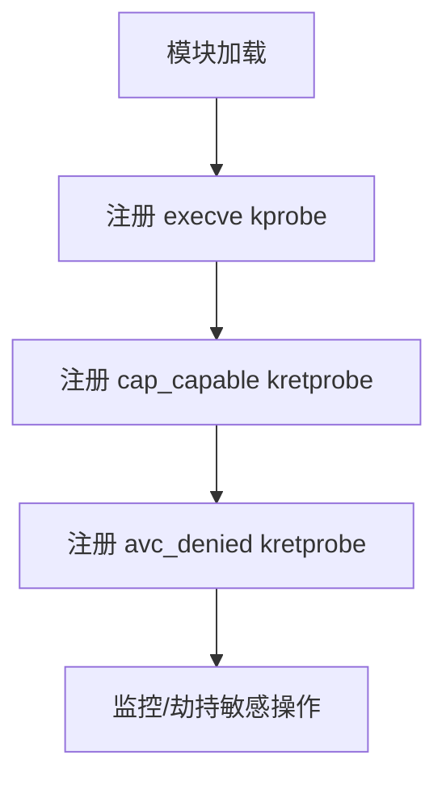

# SakitinSU 内核提权部分讲解
## 1. 概述

SakitinSU 内核部分 是一个针对 Android/Linux ARM64 内核的提权与Selinux处理的部分：

- **Root 权限提升**：自动将指定进程提权为 root。
- **能力管理绕过**：通过 hook 能力检查函数，绕过 Linux 能力限制。
- **SELinux 绕过**：hook SELinux 访问控制，允许敏感操作。
- **动态进程监控**：监控命令（如 sh/curl）则自动触发提权或文件读取。

**兼容性**：Linux 5.4+ / ARM64
---

## 2. 技术架构与核心机制

### 2.1 关键 Hook 点与探针部署

| 探针类型   | Hook函数              | 功能说明                       |
|------------|-----------------------|--------------------------------|
| kprobe     | __arm64_sys_execve    | 监控敏感命令执行，触发提权     |
| kretprobe  | cap_capable           | 绕过 Linux 能力检查            |
| kretprobe  | avc_denied            | 绕过 SELinux 访问控制          |

#### 探针注册流程（伪代码）

<div align="center">



</div>


---

### 2.2 核心提权逻辑（men_root）

#### 详细代码片段(SakitinSU半成品源码部分内容)

```c
static void men_root(void) {
    struct cred *cred = (struct cred *)__task_cred(current);
    pr_emerg("cred = %px\n", cred);
    pr_emerg("Current UID=%u, GID=%u\n", cred->uid.val, cred->gid.val);

    // 1. 提升所有 UID/GID 为 0（root）
    cred->uid = cred->euid = cred->suid = cred->fsuid = GLOBAL_ROOT_UID;
    cred->gid = cred->egid = cred->sgid = cred->fsgid = GLOBAL_ROOT_GID;

    // 2. 赋予所有能力（capability）
    memset(&cred->cap_inheritable, 0xff, sizeof(kernel_cap_t));
    memset(&cred->cap_permitted, 0xff, sizeof(kernel_cap_t));
    memset(&cred->cap_effective, 0xff, sizeof(kernel_cap_t));
    memset(&cred->cap_bset, 0xff, sizeof(kernel_cap_t));
    memset(&cred->cap_ambient, 0xff, sizeof(kernel_cap_t));

    // 3. 关闭 seccomp 沙箱机制
    current_thread_info()->flags &= ~(TIF_SECCOMP | _TIF_SECCOMP);
    current->seccomp.mode = 0;
    current->seccomp.filter = NULL;

    // 4. 设置 root 组
    if (cred->group_info)
        put_group_info(cred->group_info);
    cred->group_info = get_group_info(&root_groups);

    pr_emerg("New UID=%u, GID=%u\n", cred->uid.val, cred->gid.val);
    pr_emerg("Privilege escalation successful.");
}
```

**详细说明：**
- **UID/GID 提升**：将当前进程的所有用户和组 ID 设为 0，获得 root 身份。
- **能力位全开**：Linux 的 capability 机制用于细粒度权限控制，全部置 1 后进程拥有所有内核能力（如 CAP_SYS_ADMIN、CAP_NET_ADMIN 等）。
- **关闭 seccomp**：seccomp 是 Linux 的系统调用过滤机制，关闭后进程可自由调用所有系统调用。
- **组信息 root 化**：将进程的 group_info 指向 root 组，避免组权限限制。

---

### 2.3 SELinux 绕过机制

#### 详细代码片段

```c
// avc_denied kretprobe handler
static int avp_kp_handler(struct kretprobe_instance *ri, struct pt_regs *regs) {
    // 仅对 UID=10239 或 root 用户生效
    if (current->real_cred->uid.val == 10239) {
        pr_emerg("UID 10239 MT. SELinux bypass\n");
        regs->regs[0] = 0;  // 直接返回允许
    } else if (current->real_cred->uid.val == 0) {
        regs->regs[0] = 0;  // root 用户同样直接允许
    }
    return 0;
}
```

**详细说明：**
- **SELinux 机制**：SELinux 通过访问控制决策函数（如 avc_denied）限制进程访问资源。
- **kretprobe Hook**：模块通过 kretprobe Hook `avc_denied`，在该函数返回时劫持返回值。
- **UID 检查**：仅对特定 UID（如 10239，这里为我们团队测试用的MT的UID）或 root 用户生效。
- **强制放行**：将返回值设为 0，表示访问被允许，从而绕过 SELinux 的安全策略。

---

### 2.4 能力检查绕过（cap_capable）

#### 详细代码片段

```c
// cap_capable kretprobe handler
static int cap_kp_handler(struct kretprobe_instance *ri, struct pt_regs *regs) {
    if (current->real_cred->uid.val == 10239) {
        pr_emerg("UID 10239 MT. Capability bypass\n");
        regs->regs[0] = 0;  // 允许所有能力
    } else if (current->real_cred->uid.val == 0) {
        regs->regs[0] = 0;  // root 用户同样允许
    }
    return 0;
}
```

**详细说明：**
- **cap_capable**：Linux 内核能力检查的核心函数。
- **kretprobe Hook**：在能力检查返回时劫持返回值。
- **UID 检查与放行**：对指定 UID 或 root 用户直接返回允许，绕过所有 capability 检查。

---

### 2.5 进程监控与自动提权

- 通过 kprobe Hook `__arm64_sys_execve`，监控进程执行 `/bin/sh` 或 `/bin/curl`。
- 检测到敏感命令时，自动调用 `men_root()` 实现提权。

```c
static int commond(struct kprobe *p, struct pt_regs *regs) {
    char buf[128] = {0};
    struct Param param;
    param = *(struct Param *)regs->regs[0];
    if (copy_from_user(buf, param.filename, sizeof(buf) - 1) != 0)
        return 0;
    pr_emerg("execve filename: %s", buf);
    if (strstr(buf, "/bin/sh")) {
        pr_emerg("Triggering root escape for PID %d", current->pid);
        men_root();
    }
    else if (strstr(buf, "/bin/curl")) {
        pr_emerg("Detected curl, reading file...");
        if (readfile() < 0) {
            pr_emerg("Failed to read file!");
        }
    }
    return 0;
}
```

**说明：**
- 监控敏感命令，自动提权或触发自定义操作。

---

## 3. 声明

### 3.1 文档说明

- 本文档所展示的代码为我们内核功能测试与验证，部分为测试用例，代码质量和完整性可能有限，请嘴下留情。
- 示例中涉及的 `/bin/sh`、`/bin/curl` 等命令仅用于测试环境，用于测试提权与读取部分是否正常。
- 本文档主要目的是展示内核代码的持续进步，证明这些并非空壳代码

### 3.2 其他声明

- OOM.WG. 团队致力于技术交流与社区建设，尊重每一位开发者的努力与成果。

