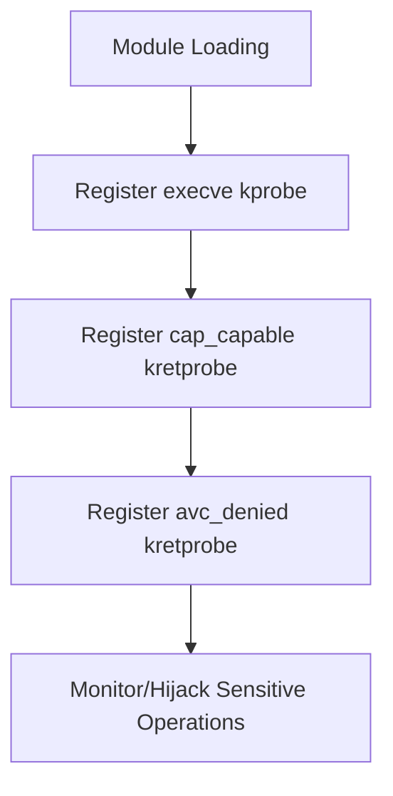

# ShiroSU Kernel Privilege Escalation Explained

## 1. Overview

The ShiroSU kernel component is a module for privilege escalation and SELinux manipulation on the Android kernel:

- **Root privilege elevation**: Automatically elevates a specified process to root.
- **Capability bypass**: Bypasses Linux capability restrictions by hooking the capability checking functions.
- **SELinux bypass**: Hooks SELinux access control to permit sensitive operations.
- **Dynamic process monitoring**: Monitors `su` execution to automatically trigger privilege escalation.

---

## 2. Technical Architecture and Core Mechanisms

### 2.1 Key Hook Points and Probe Deployment

| Probe Type | Hook Function | Description |
|---|---|---|
| kprobe | sys_execve (as needed) | Monitors execution of sensitive commands, triggering privilege escalation. |
| kretprobe | cap_capable | Bypasses Linux capability checks. |
| kretprobe | avc_denied | Bypasses SELinux access control. |

#### Probe Registration Flow

<div align="center">



</div>

---

### 2.2 Core Privilege Escalation Logic

#### Code Snippet

```c:no-line-numbers
struct cred *cred = (struct cred *)__task_cred(current);

// 1. Elevate to root
cred->uid = cred->euid = cred->suid = cred->fsuid = GLOBAL_ROOT_UID;
cred->gid = cred->egid = cred->sgid = cred->fsgid = GLOBAL_ROOT_GID;
cred->securebits = 0;

// 2. Grant all capabilities
memset(&cred->cap_inheritable, 0xff, sizeof(kernel_cap_t));
memset(&cred->cap_permitted, 0xff, sizeof(kernel_cap_t));
memset(&cred->cap_effective, 0xff, sizeof(kernel_cap_t));
memset(&cred->cap_bset, 0xff, sizeof(kernel_cap_t));
memset(&cred->cap_ambient, 0xff, sizeof(kernel_cap_t));

// 3. Disable seccomp (as needed)
current_thread_info()->syscall_work &= ~SYSCALL_WORK_SECCOMP;
current_thread_info()->flags &= ~(TIF_SECCOMP | _TIF_SECCOMP);
current->seccomp.mode = 0;
current->seccomp.filter = NULL;

// 4. Set root group
if (cred->group_info) {
    // Set group to root ...
}
```

**Detailed Explanation:**

- **UID/GID Elevation**: Sets all user and group IDs of the current process to 0, obtaining root privileges.
- **Full Capability Grant**: Sets all Linux `capability` bits to `1`, giving the process all kernel capabilities.
- **Seccomp Disable**: Disables the Linux system call filtering mechanism (`seccomp`), allowing the process to invoke any system call.
- **Root Group Setting**: Sets the process's `group_info` to the root group, preventing group-based access restrictions.

---

### 2.3 SELinux Bypass Mechanism

#### Code Snippet

```c:no-line-numbers
// avc_denied kretprobe handler

if (current->real_cred->uid.val == /* Whitelisted UID */) {
    regs->regs[0] = 0;  // Allow for whitelisted UID
} else if (!current->real_cred->uid.val) {
    regs->regs[0] = 0;  // Allow for root
}
```

**Detailed Explanation:**

- **SELinux Mechanism**: `SELinux` uses access control decision functions (like `avc_denied`) to restrict process resource access.
- **kretprobe Hook**: The module hooks `avc_denied` using a kretprobe, intercepting the return value.
- **UID Check**: Only applies to specific `UIDs` (such as the ShiroSU manager and any whitelisted UID), or `root`.
- **Force Allow**: Sets the return value to 0, indicating access permission, bypassing SELinux security policies.

---

### 2.4 Capability Check Bypass (cap_capable)

#### Code Snippet

```c:no-line-numbers
// cap_capable kretprobe handler

if (current->real_cred->uid.val == /* Whitelisted UID */) {
    regs->regs[0] = 0;  // Allow for whitelisted UID
} else if (!current->real_cred->uid.val) {
    regs->regs[0] = 0;  // Allow for root
}
```

**Detailed Explanation:**

- **cap_capable**: The core Linux kernel function for capability checks.
- **kretprobe Hook**: Hooks the return value of the capability checking function.
- **UID Check and Allow**: Returns `0` for specified `UIDs` or `root`, bypassing all capability checks.

---

### 2.5 Process Monitoring and Automatic Privilege Escalation

- Hooks `sys_execve` (specific name depends on kernel version and architecture) to monitor process execution of `su`.
- Automatically calls the privilege escalation function when `su` is detected.

```c
char buf[128] = {0};
struct Param param;
param = *(struct Param *)regs->regs[0];
if (copy_from_user(buf, param.filename, sizeof(buf) - 1))
    return 0;

if (!strcmp(buf, "/system/bin/su")) {
    // Elevate process to root ...
}
```

**Explanation**:

- Monitors `su` execution and automatically elevates to `root`.

---

## 3. Disclaimer

### 3.1 Document Description

- The code examples in this document are test code or pseudocode from ShiroSU kernel parts, potentially with limitations in quality and completeness, used for testing purposes. Please handle with caution.
- This document aims to demonstrate ongoing kernel code evolution and illustrate its functionality rather than providing complete, production-ready code.

### 3.2 Other Disclaimers

- `OOM. WG.` is committed to technical communication and community building. We respect every developer's efforts and achievements.
