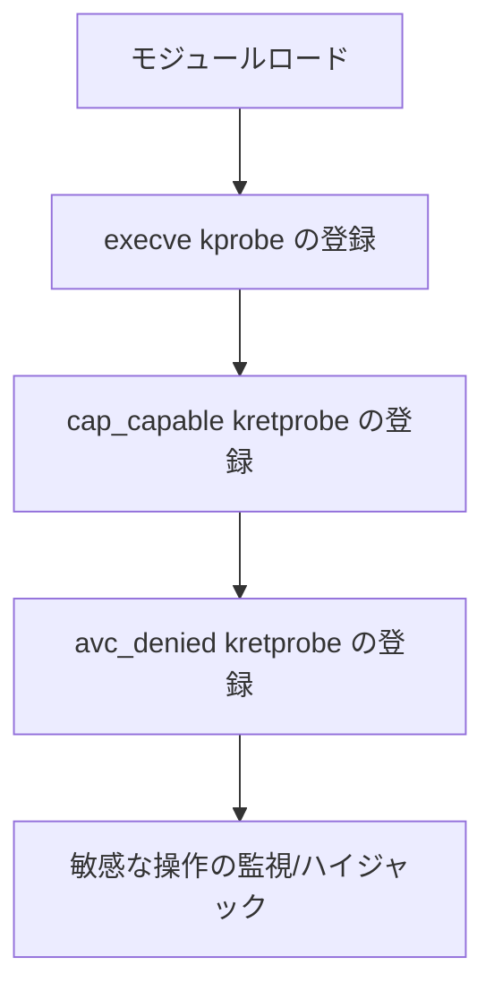

# SakitinSU カーネル権限昇格部分解説

## 1. 概要

SakitinSU カーネル部分は、Android カーネルに対する権限昇格と SELinux 処理の部分です。

- **root 権限昇格**: 指定されたプロセスを自動的に root に昇格します。
- **能力管理バイパス**: hook を使用して能力チェック関数をフックし、Linux の能力制限をバイパスします。
- **SELinux バイパス**: SELinux アクセス制御をフックし、機密操作を許可します。
- **動的プロセス監視**: `su` の実行を監視し、自動的に権限昇格操作をトリガーします。

---

## 2. 技術アーキテクチャとコアメカニズム

### 2.1 主要 Hook ポイントとプローブの配置

| プローブタイプ | Hook 関数           | 機能説明                   |
| --------- | ------------------- | -------------------------- |
| kprobe    | sys_execve (状況に応じて) | 敏感なコマンド実行を監視し、権限昇格をトリガー |
| kretprobe | cap_capable         | Linux の能力チェックをバイパス |
| kretprobe | avc_denied          | SELinux アクセス制御をバイパス |

#### プローブ登録プロセス

<div align="center">



</div>

---

### 2.2 コア権限昇格ロジック

#### 部分コードスニペット

```c:no-line-numbers
struct cred *cred = (struct cred *)__task_cred(current);

// 1. root に昇格
cred->uid = cred->euid = cred->suid = cred->fsuid = GLOBAL_ROOT_UID;
cred->gid = cred->egid = cred->sgid = cred->fsgid = GLOBAL_ROOT_GID;
cred->securebits = 0;

// 2. 全ての能力を付与
memset(&cred->cap_inheritable, 0xff, sizeof(kernel_cap_t));
memset(&cred->cap_permitted, 0xff, sizeof(kernel_cap_t));
memset(&cred->cap_effective, 0xff, sizeof(kernel_cap_t));
memset(&cred->cap_bset, 0xff, sizeof(kernel_cap_t));
memset(&cred->cap_ambient, 0xff, sizeof(kernel_cap_t));

// 3. seccomp を無効化 (状況に応じて)
current_thread_info()->syscall_work &= ~SYSCALL_WORK_SECCOMP;
current_thread_info()->flags &= ~(TIF_SECCOMP | _TIF_SECCOMP);
current->seccomp.mode = 0;
current->seccomp.filter = NULL;

// 4. root グループを設定
if (cred->group_info) {
    // グループを root に設定 ...
}
```

**詳細説明**:

- **UID/GID の昇格**: 現在のプロセスの全てのユーザーIDとグループIDを 0 に設定し、`root` 権限を取得します。
- **能力ビットの全開**: Linux の `capability` メカニズムは、細粒度の権限制御に使用されます。全てを `1` に設定することで、プロセスは全てのカーネル能力を持つようになります。
- **seccomp の無効化**: `seccomp` は Linux のシステムコールフィルタリングメカニズムです。無効化することで、プロセスは全てのシステムコールを自由に呼び出すことができます。
- **グループ情報の root 化**: プロセスの `group_info` を `root` グループに設定し、グループ権限による制限を回避します。

---

### 2.3 SELinux バイパスメカニズム

#### 部分コードスニペット

```c:no-line-numbers
// avc_denied kretprobe handler

if (current->real_cred->uid.val == /* ホワイトリスト UID */) {
    regs->regs[0] = 0;  // ホワイトリスト UID は許可に設定
} else if (!current->real_cred->uid.val) {
    regs->regs[0] = 0;  // root も同様に許可に設定
}
```

**詳細説明**:

- **SELinux メカニズム**: `SELinux` はアクセス制御決定関数（例: `avc_denied`）を使用して、プロセスのリソースへのアクセスを制限します。
- **kretprobe hook**: モジュールは kretprobe を使用して `avc_denied` をフックし、この関数が返るときに戻り値をハイジャックします。
- **UID チェック**: 特定の `UID`（例: `SakitinSU マネージャー` とユーザーが設定したホワイトリスト UID）または `root` のみに有効です。
- **強制許可**: 戻り値を 0 に設定し、アクセスが許可されたことを示し、SELinux のセキュリティポリシーをバイパスします。

---

### 2.4 能力チェックバイパス (cap_capable)

#### 部分コードスニペット

```c:no-line-numbers
// cap_capable kretprobe handler

if (current->real_cred->uid.val == /* ホワイトリスト UID */) {
    regs->regs[0] = 0;  // ホワイトリスト UID は許可に設定
} else if (!current->real_cred->uid.val) {
    regs->regs[0] = 0;  // root も同様に許可に設定
}
```

**詳細説明**:

- **cap_capable**: Linux カーネル能力チェックの中核関数です。
- **kretprobe hook**: 能力チェックが返るときに戻り値をハイジャックします。
- **UID チェックと許可**: 指定された `UID` または `root` に対して許可を返し、全ての `capability` チェックをバイパスします。

---

### 2.5 プロセス監視と自動権限昇格

- kprobe を使用して `sys_execve` (具体的なアドレス名はカーネルバージョンとアーキテクチャによって異なります) をフックし、`su` のプロセス実行を監視します。
- `su` の実行を検出すると、自動的に権限昇格関数を呼び出して権限を昇格させます。

```c
char buf[128] = {0};
struct Param param;
param = *(struct Param *)regs->regs[0];
if (copy_from_user(buf, param.filename, sizeof(buf) - 1))
    return 0;

if (!strcmp(buf, "/system/bin/su")) {
    // プロセスを root に昇格 ...
}
```

**説明**:

- `su` の実行を監視し、自動的に `root` に権限を昇格させます。

---

## 3. 免責事項

### 3.1 ドキュメントの説明

- このドキュメントで示されているコードは、SakitinSU カーネルの一部テストコードまたは擬似コードであり、一部はテストケースです。コードの品質と完全性には限りがある可能性がありますので、ご容赦ください。
- このドキュメントの主な目的は、カーネルコードの継続的な進歩を示し、これらが空のコードではないことを証明することです。

### 3.2 その他の免責事項

- `OOM. WG.` は技術交流とコミュニティ構築に尽力しており、全ての開発者の努力と成果を尊重しています。