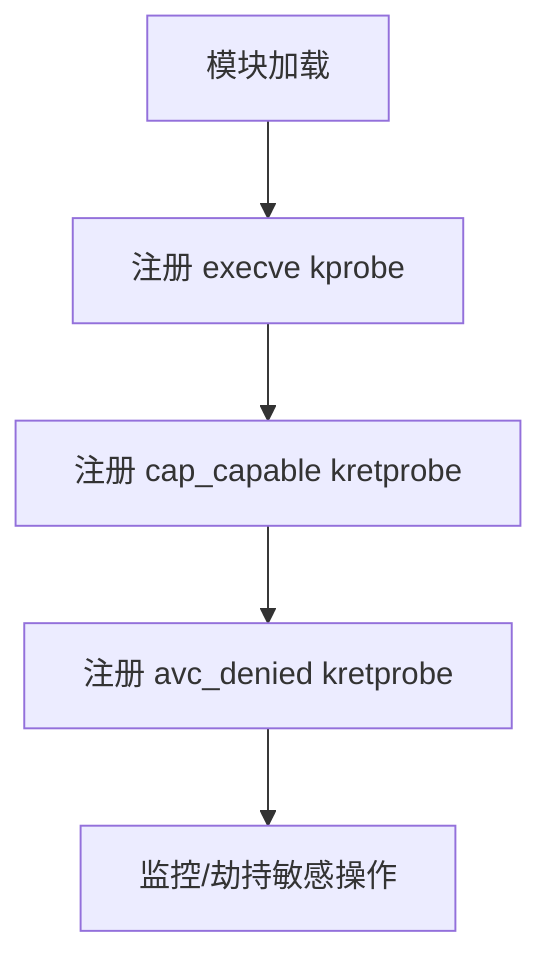

# SakitinSU 内核提权部分讲解

## 1. 概述

SakitinSU 内核部分 是一个针对 Android 内核的提权与 Selinux 处理的部分：

- **root 权限提升**：自动将指定进程提权为 root。
- **能力管理绕过**：通过 hook 能力检查函数，绕过 Linux 能力限制。
- **SELinux 绕过**：hook SELinux 访问控制，允许敏感操作。
- **动态进程监控**：监控 `su` 执行自动触发提权操作。

---

## 2. 技术架构与核心机制

### 2.1 关键 Hook 点与探针部署

| 探针类型  | Hook 函数           | 功能说明                   |
| --------- | ------------------- | -------------------------- |
| kprobe    | sys_execve (按情况) | 监控敏感命令执行，触发提权 |
| kretprobe | cap_capable         | 绕过 Linux 能力检查        |
| kretprobe | avc_denied          | 绕过 SELinux 访问控制      |

#### 探针注册流程

<div align="center">



</div>

---

### 2.2 核心提权逻辑

#### 部分代码片段

```c:no-line-numbers
struct cred *cred = (struct cred *)__task_cred(current);

// 1. 提权为 root
cred->uid = cred->euid = cred->suid = cred->fsuid = GLOBAL_ROOT_UID;
cred->gid = cred->egid = cred->sgid = cred->fsgid = GLOBAL_ROOT_GID;
cred->securebits = 0;

// 2. 赋予所有能力
memset(&cred->cap_inheritable, 0xff, sizeof(kernel_cap_t));
memset(&cred->cap_permitted, 0xff, sizeof(kernel_cap_t));
memset(&cred->cap_effective, 0xff, sizeof(kernel_cap_t));
memset(&cred->cap_bset, 0xff, sizeof(kernel_cap_t));
memset(&cred->cap_ambient, 0xff, sizeof(kernel_cap_t));

// 3. 关闭 seccomp (部分需要依情况)
current_thread_info()->syscall_work &= ~SYSCALL_WORK_SECCOMP;
current_thread_info()->flags &= ~(TIF_SECCOMP | _TIF_SECCOMP);
current->seccomp.mode = 0;
current->seccomp.filter = NULL;

// 4. 设置 root 组
if (cred->group_info) {
    // 设置组为 root ...
}
```

**详细说明：**

- **UID/GID 提升**：将当前进程的所有用户和组 ID 设为 0，获得 `root` 身份。
- **能力位全开**：Linux 的 `capability` 机制用于细粒度权限控制，全部置 `1` 后进程拥有所有内核能力。
- **关闭 seccomp**：`seccomp` 是 Linux 的系统调用过滤机制，关闭后进程可自由调用所有系统调用。
- **组信息 root 化**：将进程的 `group_info` 指向 `root` 组，避免组权限限制。

---

### 2.3 SELinux 绕过机制

#### 部分代码片段

```c:no-line-numbers
// avc_denied kretprobe handler

if (current->real_cred->uid.val == /* 白名单 UID */) {
    regs->regs[0] = 0;  // 白名单 UID 直接设置允许
} else if (!current->real_cred->uid.val) {
    regs->regs[0] = 0;  // root 同样设置允许
}
```

**详细说明：**

- **SELinux 机制**：`SELinux` 通过访问控制决策函数（如 `avc_denied`）限制进程访问资源。
- **kretprobe hook**：模块通过 kretprobe hook `avc_denied`，在该函数返回时劫持返回值。
- **UID 检查**：仅对特定 `UID`（如 `SakitinSU 管理器` 以及由用户设置的白名单 UID）或 `root` 生效。
- **强制放行**：将返回值设为 0，表示访问被允许，从而绕过 SELinux 的安全策略。

---

### 2.4 能力检查绕过（cap_capable）

#### 部分代码片段

```c:no-line-numbers
// cap_capable kretprobe handler

if (current->real_cred->uid.val == /* 白名单 UID */) {
    regs->regs[0] = 0;  // 白名单 UID 直接设置允许
} else if (!current->real_cred->uid.val) {
    regs->regs[0] = 0;  // root 同样设置允许
}
```

**详细说明：**

- **cap_capable**：Linux 内核能力检查的核心函数。
- **kretprobe hook**：在能力检查返回时劫持返回值。
- **UID 检查与放行**：对指定 `UID` 或 `root` 直接返回允许，绕过所有 `capability` 检查。

---

### 2.5 进程监控与自动提权

- 通过 kprobe hook `sys_execve` (具体地址名称需要依内核版本以及架构而定)，监控进程执行 `su`。
- 检测到执行 `su` 时，自动调用提权函数实现提权。

```c
char buf[128] = {0};
struct Param param;
param = *(struct Param *)regs->regs[0];
if (copy_from_user(buf, param.filename, sizeof(buf) - 1))
    return 0;

if (!strcmp(buf, "/system/bin/su")) {
    // 提权进程为 root ...
}
```

**说明：**

- 监控 `su` 执行，自动提权为 `root`。

---

## 3. 声明

### 3.1 文档说明

- 本文档所展示的代码为 SakitinSU 内核的部分测试代码或伪代码，部分为测试用例，代码质量和完整性可能有限，请嘴下留情。
- 本文档主要目的是展示内核代码的持续进步，证明这些并非空壳代码

### 3.2 其他声明

- `OOM. WG.` 致力于技术交流与社区建设，尊重每一位开发者的努力与成果。
